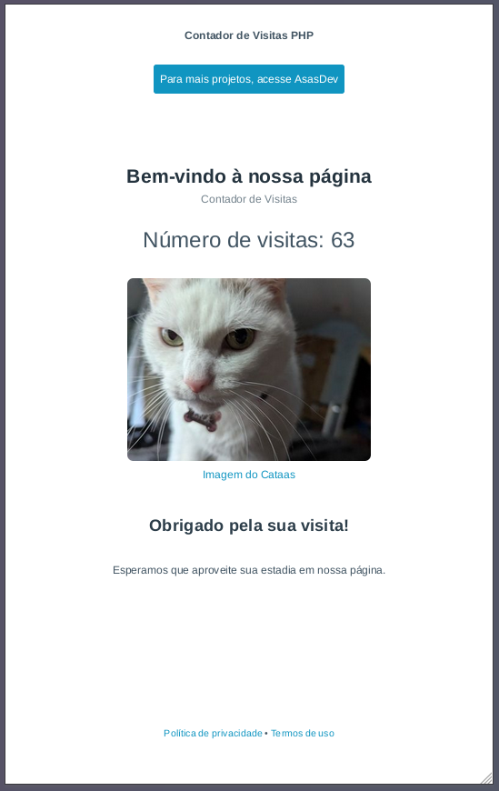

   
  <h1>Contador de Visitas em PHP</h1>  
  <ul style="list-style: none; padding: 0; margin: 0;">
    <li><a href="https://asasdev.com.br/contador_visita/" target="_blank" role="button">Site Demostração</a></li>
  </ul>
  

    

   

